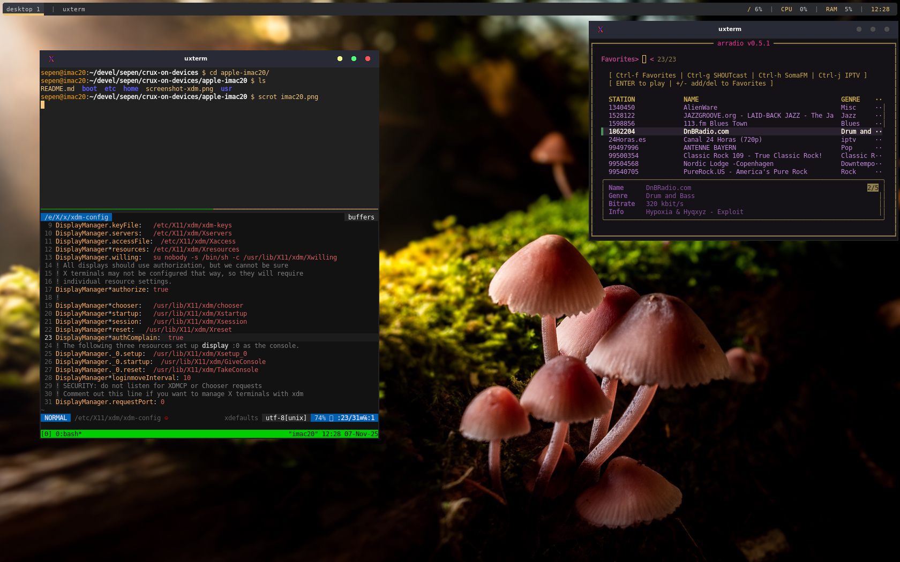
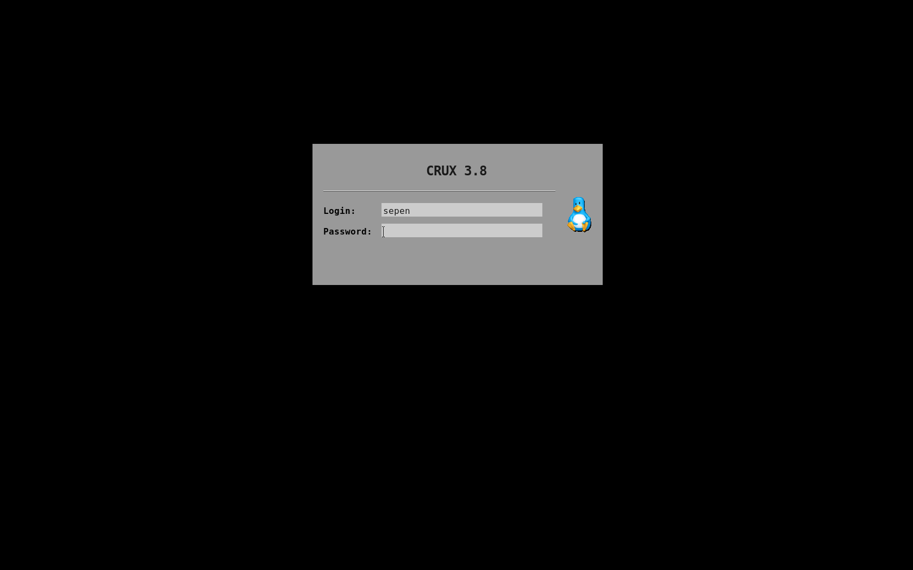

# CRUX on Apple iMac 20


### About this device

About May 2022 I bought this device for 40 euros in the second hand market.

The computer had a common defect found in iMacs: the screen only displayed artifacts due to a damaged graphics card. This happens after long periods of use in a vertical position, where the heat causes the GPU chip to slightly detach from its pins downward because of gravity when it gets hot. Fortunately, I was able to replace it with another one that cost less than 15 euros.

After that I upgraded it to 4G of RAM and added a 500GB SSD disk for better performance.

The native option is El Capitan, and to be honest, its performance isn’t bad, but many things are starting to become obsolete and no longer receive updates, so it was time to see what I could do with CRUX.


### Specification

iMac 20" (Early 2008, Model A1224)

- **Model:** iMac8,1 — EMC 2133 / 2210  
- **Display:** 20" glossy LCD, 1680×1050 (16:10)  
- **CPU:** Intel Core 2 Duo 2.4 GHz / 2.66 GHz (Penryn)  
- **GPU:** ATI Radeon HD 2400 XT (128 MB) / HD 2600 Pro (256 MB)  
- **RAM:** DDR2-667 MHz, up to 6 GB (2 × SO-DIMM)  
- **Storage:** 250–320 GB SATA II HDD (upgradeable to SSD)  
- **Optical:** 8× SuperDrive (DVD±RW DL)  
- **Wi-Fi:** Broadcom BCM94321 (802.11 a/b/g/n)  
- **Bluetooth:** 2.1 + EDR  
- **Ports:** 3× USB 2.0, FW400, FW800, Mini-DVI, Audio I/O  
- **Power:** 180 W internal PSU  
- **macOS Support:** 10.5 Leopard → 10.11 El Capitan


## Installation

After proper partitioning, the installation was started from a USB drive with the CRUX 3.8 image, installing all the packages from the core collection and some from opt to enable Wi-Fi (wireless-tools, wpa_supplicant, ...) and EFI boot (grub2-efi, efivar, efibootmgr, ...). With that, I now have a dual-boot setup, keeping macOS El Capitan and CRUX 3.8:

Partitions:
```shell
$ sudo fdisk -l
Disk /dev/sda: 465.76 GiB, 500107862016 bytes, 976773168 sectors
Disk model: Samsung SSD 860
Units: sectors of 1 * 512 = 512 bytes
Sector size (logical/physical): 512 bytes / 512 bytes
I/O size (minimum/optimal): 512 bytes / 512 bytes
Disklabel type: gpt
Disk identifier: A3EA75C9-F760-43B2-8198-B2C40997FA4B

Device         Start       End   Sectors   Size Type
/dev/sda1       2048   1050623   1048576   512M EFI System
/dev/sda2    1050624 314353887 313303264 149.4G Apple HFS/HFS+
/dev/sda3  314353888 315623423   1269536 619.9M Apple boot
/dev/sda4  315623424 944769023 629145600   300G Linux filesystem
/dev/sda5  944769024 976773119  32004096  15.3G Linux swap
```


### Packages

Select all packages from core, opt and xorg and grub2 as the bootloader

Wait until installation finishes


### Kernel

Uncompress and prepare kernel sources
```
# cd /usr/src
# tar xf linux-6.12.23.tar.xz
# ln -s linux-6.12.23 linux
```

Copy kernel config file [config-6.12.23](boot/config-6.12.23)
```
# wget https://raw.githubusercontent/sepen/crux-on-devices/master/apple-imac20/boot/config-6.12.23
# mv config-6.12.23 /usr/src/linux-6.12.23/.config
```

Build the kernel
```
# cd /usr/src/linux-6.12.23
# make
```

Install kernel files
```
# cd /usr/src/linux-6.12.23
# make modules_install
# cp arch/x86_64/boot/bzImage /boot/vmlinuz-6.12.23
# cp .config /boot/config-6.12.23
# cp System.map /boot/System.map-6.12.23
```

### Bootloader

Make symlinks using generic names so that the bootloader auto-discovers the config
```
# cd /boot
# ln -s vmlinuz-6.12.23 vmlinuz
# ln -s config-6.12.23 config
# ln -s System.map-6.12.23 System.map
```

Create grub config file and install the bootloader
```
# mkdir /boot/grub 
# grub-mkconfig -o /boot/grub/grub.cfg
# grub-install
```

## Ports

### pkgutils

Configure pkgbuild to use -j2 in CFLAGS

[/etc/pkgmk.conf](etc/pkgmk.conf)


## Desktop



### Xorg

Activate `tap to click` 
```shell
$ echo '# Activate "tap to click" on touchpad
Section "InputClass"
	Identifier "libinput touchpad catchall"
	MatchIsTouchpad "on"
	MatchDevicePath "/dev/input/event*"
	Driver "libinput"
	Option "Tapping" "on"
EndSection' | sudo tee /etc/X11/xorg.conf.d/40-libinput.conf
```

### Xterm/UXterm

Install xrdb tool
```shell
$ sudo prt-get depinst xorg-xrdb
```

Create ~/.Xresources

```shell
$ xrdb -merge ~/.Xresources
```

Additionally we want some fonts
```shell
$ sudo prt-get depinst xorg-fonts-adobe-75dpi xorg-fonts-adobe-100dpi nerd-fonts-dejavu siji-ng
```

### Firefox

ALSA support was dropped starting Firefox 52.0 and later.
https://support.mozilla.org/en-US/questions/1209469

I still want to use ALSA and try to avoid pulseaudio as much as possible, so `apulse` comes to the rescue:
```shell
$ sudo prt-get depinst apulse
$ apulse firefox
```

### Openbox

Install `imlib2` and rebuild `openbox` to have icon support
```shell
$ sudo prt-get depinst imlib2
$ sudo prt-get update -fr openbox
```

Extras
```shell
$ sudo prt-get depinst xdg-utils
```

Install openbox configuration manager
```shell
$ sudo prt-get depinst obconf
```

Install openbox themes. Then apply a theme you desire using `obconf`
```shell
$ mkdir -p ~/.themes
$ git clone https://github.com/terroo/openbox-themes themes-1 && \
    mv themes-1/* ~/.themes && rm -rf themes-1
$ git clone https://github.com/addy-dclxvi/openbox-theme-collections themes-2 && \
    mv themes-2/* ~/.themes && rm -rf themes-2
$ obconf
```

Auto-start openbox when running `startx` command:
[~/.config/openbox/autostart](home/sepen/.config/openbox/autostart)

Show openbox menu when windows key is pressed,
Edit [~/.config/openbox/rc.xml](home/sepen/.config/openbox/rc.xml) and add this code block:
```xml
<keybind key="Super_L">
  <action name="ShowMenu">
    <menu>root-menu</menu>
  </action>
</keybind>
```
And then reread the Openbox settings:
```shell
$ openbox --reconfigure
```

Generate openbox menu with `obmenu-generator`
```shell
$ sudo prt-get depinst obmenu-generator
$ obmenu-generator -i > $HOME/.config/openbox/menu.xml
```

Add a dynamic menu by copying this contents to [~/.config/openbox/menu.xml](home/sepen/.config/openbox/menu.xml)

```xml
<?xml version="1.0" encoding="utf-8"?>
<openbox_menu xmlns="http://openbox.org/"
 xmlns:xsi="http://www.w3.org/2001/XMLSchema-instance"
  xsi:schemaLocation="http://openbox.org/">
    <menu id="root-menu" label="obmenu-generator" execute="/usr/bin/obmenu-generator -i" />
</openbox_menu>
```

### Polybar

Install an eye candy status bar: `polybar`
```shell
$ sudo prt-get depinst polybar
$ cp /usr/share/polybar/config.example ~/.config/polybar/config
$ polybar -c ~/.config/polybar/config example
```

### XDM



Install Xorg Display Manager
```shell
$ sudo prt-get depinst xorg-xdm
```

Enable it
```shell
$ ln -s .xinitrc ~/.xsession
```

Test it
```shell
$ sudo /etc/rc.d/xdm start
```

Customize
```shell
$ sudo vim /usr/X11/xdm/Xresources
$ sudo cp cruxlogo.xpm /usr/lib/X11/xdm/pixmaps
```

Take a screenshot of XDM login screen using scrot
```shell
$ sudo prt-get depinst scrot
$ sudo vim /usr/lib/X11/xdm/Xsetup_0
```
Add these lines at the end (or before any exec lines):
```
(sleep 5; DISPLAY=:0 /usr/bin/scrot /tmp/xdm_login.png) &
```
