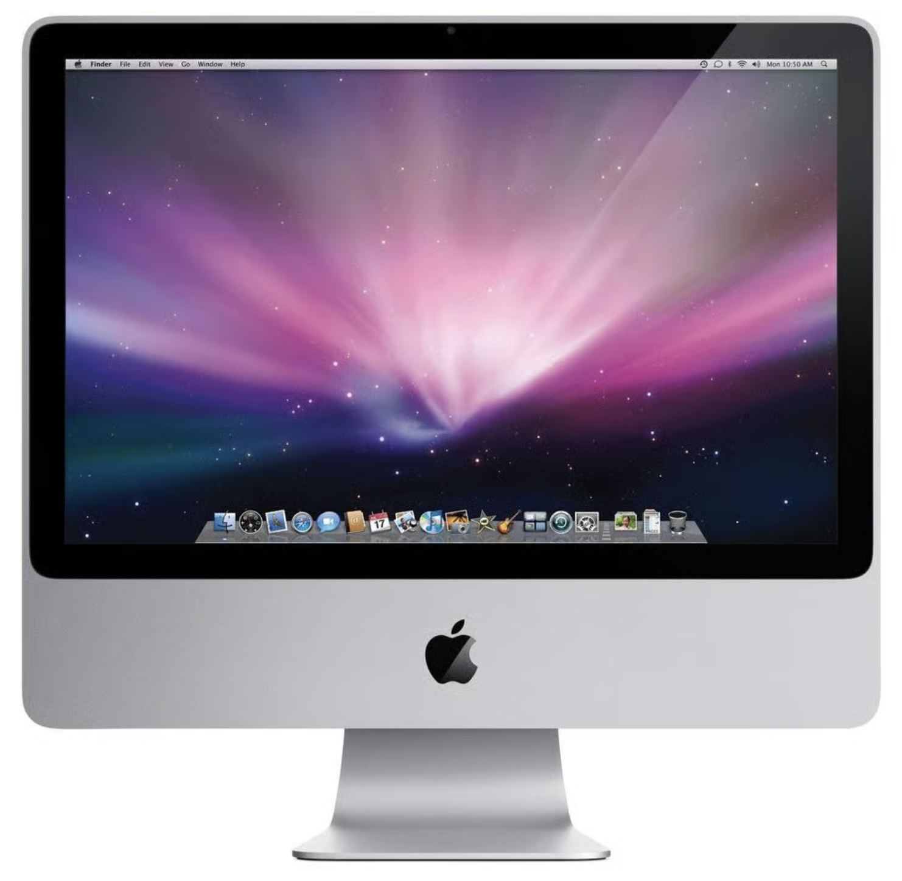
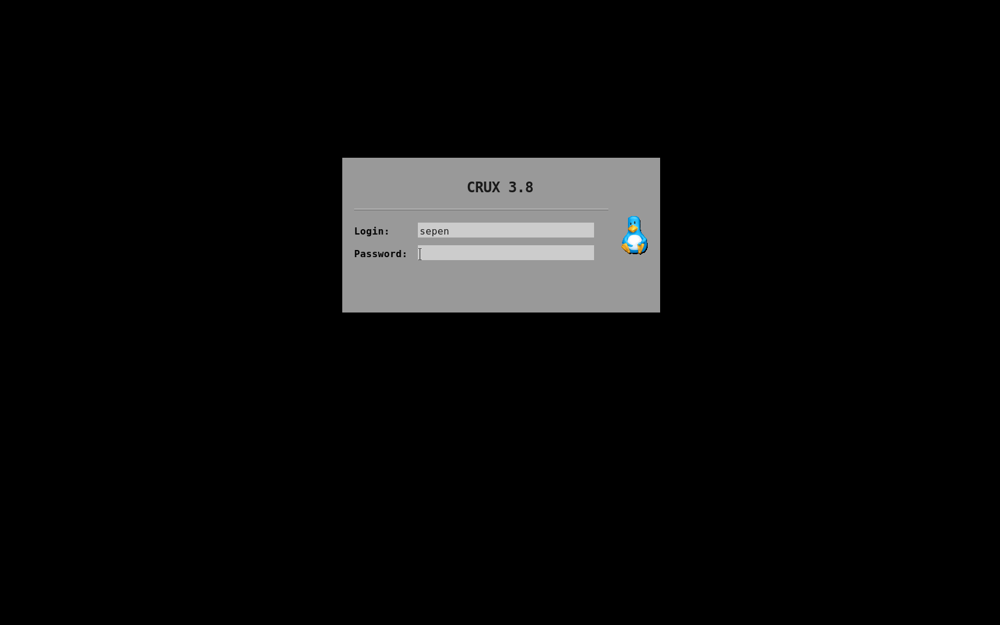

# CRUX on iMac 20" (A1224 / iMac8,1)




### About this device

In May 2022 I bought this machine on the second-hand market for 45 euros. It came with a common fault on these models: nothing on screen. When the iMac sits upright for years, the original GPU tends to desolder; reballing fixes it for a while but the problem often returns.

I replaced the graphics card with an **ATI Radeon HD 2600** with 256 MB of RAM (about 25 euros) and it worked straight away. I also swapped the original disk for a **500 GB SSD** and maxed out the RAM at **4 GB SODIMM**.

The native option is **macOS El Capitan** — performance is still acceptable, but much of the stack is obsolete and no longer updated, so it was time to try **CRUX**. The machine now **dual-boots macOS and CRUX 3.8**.


### Specification

iMac 20" (Early 2008, model A1224 / iMac8,1 — EMC 2133 / 2210)

* **Processor:** Intel Core 2 Duo E8335 @ 2.66 GHz (2 cores, 2 threads), 6 MB L3
* **Chipset:** Intel Mobile PM965/GM965 (ICH8M)
* **Memory:** 4 GB DDR2 SO-DIMM
* **Graphics:** AMD/ATI Mobility Radeon HD 2600 XT/2700 (RV630), 256 MB (`radeon`)
* **Display:** Built-in 20" LCD, 1680×1050 @ 60 Hz
* **Storage:** Samsung SSD 860 500 GB (SATA AHCI, `ahci`)
* **Optical:** 8× SuperDrive (DVD±RW DL)
* **Ethernet:** Marvell 88E8058 Gigabit (`sky2`)
* **Wi-Fi:** Broadcom BCM4321 (`b43-pci-bridge` / `ssb`)
* **Audio:** Intel HD Audio ICH8 (`snd_hda_intel`)
* **FireWire:** LSI FW643 1394b (`firewire_ohci`)
* **USB:** Intel ICH8 UHCI/EHCI (`uhci_hcd`, `ehci-pci`)
* **Bluetooth:** 2.1 + EDR
* **Ports:** 3× USB 2.0, FW400, FW800, Mini-DVI, audio I/O
* **Power:** 180 W internal PSU
* **macOS support:** 10.5 Leopard → 10.11 El Capitan


## Installation

After proper partitioning, the installation was started from a USB drive with the CRUX 3.8 image, installing all the packages from the core collection and some from opt to enable Wi-Fi (wireless-tools, wpa_supplicant, ...) and EFI boot (grub2-efi, efivar, efibootmgr, ...). Dual-boot layout keeping macOS El Capitan and CRUX 3.8:

Partitions:
```shell
$ sudo fdisk -l
Disk /dev/sda: 465.76 GiB, 500107862016 bytes, 976773168 sectors
Disk model: Samsung SSD 860
Units: sectors of 1 * 512 = 512 bytes
Sector size (logical/physical): 512 bytes / 512 bytes
I/O size (minimum/optimal): 512 bytes / 512 bytes
Disklabel type: gpt
Disk identifier: A3EA75C9-F760-43B2-8198-B2C40997FA4B

Device         Start       End   Sectors   Size Type
/dev/sda1       2048   1050623   1048576   512M EFI System
/dev/sda2    1050624 314353887 313303264 149.4G Apple HFS/HFS+
/dev/sda3  314353888 315623423   1269536 619.9M Apple boot
/dev/sda4  315623424 944769023 629145600   300G Linux filesystem
/dev/sda5  944769024 976773119  32004096  15.3G Linux swap
```


### Packages

Select all packages from core, opt and xorg and grub2 as the bootloader

Wait until installation finishes


### Kernel

Uncompress and prepare kernel sources
```
# cd /usr/src
# tar xf linux-6.12.23.tar.xz
# ln -s linux-6.12.23 linux
```

Copy kernel config file [config-6.12.23](boot/config-6.12.23)
```
# wget https://raw.githubusercontent/sepen/crux-on-devices/master/apple-imac20/boot/config-6.12.23
# mv config-6.12.23 /usr/src/linux-6.12.23/.config
```

Build the kernel
```
# cd /usr/src/linux-6.12.23
# make
```

Install kernel files
```
# cd /usr/src/linux-6.12.23
# make modules_install
# cp arch/x86_64/boot/bzImage /boot/vmlinuz-6.12.23
# cp .config /boot/config-6.12.23
# cp System.map /boot/System.map-6.12.23
```

### Bootloader

Make symlinks using generic names so that the bootloader auto-discovers the config
```
# cd /boot
# ln -s vmlinuz-6.12.23 vmlinuz
# ln -s config-6.12.23 config
# ln -s System.map-6.12.23 System.map
```

Create grub config file and install the bootloader
```
# mkdir /boot/grub 
# grub-mkconfig -o /boot/grub/grub.cfg
# grub-install
```

## Ports

### pkgutils

Configure pkgbuild to use -j2 in CFLAGS

[/etc/pkgmk.conf](etc/pkgmk.conf)


## Desktop


### Xorg

The GPU is handled by the in-kernel **`radeon`** driver (AMD replacement card instead of the stock Intel/ATI soldered on the board).

TBD — `xorg.conf.d`, DDX/modesetting driver, acceleration, and 1680×1050 display tuning.

Activate `tap to click` 
```shell
$ echo '# Activate "tap to click" on touchpad
Section "InputClass"
	Identifier "libinput touchpad catchall"
	MatchIsTouchpad "on"
	MatchDevicePath "/dev/input/event*"
	Driver "libinput"
	Option "Tapping" "on"
EndSection' | sudo tee /etc/X11/xorg.conf.d/40-libinput.conf
```

### Wi-Fi (Broadcom b43)

The **BCM4321** (AirPort Extreme) uses the **b43** stack. Proprietary firmware (`b43-firmware` or equivalent from ports) is usually required in addition to the kernel module. Wireless packages were installed during setup (`wireless-tools`, `wpa_supplicant`, ...).

TBD — exact firmware packages and `wpa_supplicant` configuration.


### Audio

Intel HD Audio via **`snd_hda_intel`**.

TBD — ALSA mixer, default device, and testing.


### Xterm/UXterm

Install xrdb tool
```shell
$ sudo prt-get depinst xorg-xrdb
```

Create ~/.Xresources

```shell
$ xrdb -merge ~/.Xresources
```

Additionally we want some fonts
```shell
$ sudo prt-get depinst xorg-fonts-adobe-75dpi xorg-fonts-adobe-100dpi nerd-fonts-dejavu siji-ng
```

### Firefox

ALSA support was dropped starting Firefox 52.0 and later.
https://support.mozilla.org/en-US/questions/1209469

I still want to use ALSA and try to avoid pulseaudio as much as possible, so `apulse` comes to the rescue:
```shell
$ sudo prt-get depinst apulse
$ apulse firefox
```

### Openbox

Install `imlib2` and rebuild `openbox` to have icon support
```shell
$ sudo prt-get depinst imlib2
$ sudo prt-get update -fr openbox
```

Extras
```shell
$ sudo prt-get depinst xdg-utils
```

Install openbox configuration manager
```shell
$ sudo prt-get depinst obconf
```

Install openbox themes. Then apply a theme you desire using `obconf`
```shell
$ mkdir -p ~/.themes
$ git clone https://github.com/terroo/openbox-themes themes-1 && \
    mv themes-1/* ~/.themes && rm -rf themes-1
$ git clone https://github.com/addy-dclxvi/openbox-theme-collections themes-2 && \
    mv themes-2/* ~/.themes && rm -rf themes-2
$ obconf
```

Auto-start openbox when running `startx` command:
[~/.config/openbox/autostart](home/sepen/.config/openbox/autostart)

Show openbox menu when windows key is pressed,
Edit [~/.config/openbox/rc.xml](home/sepen/.config/openbox/rc.xml) and add this code block:
```xml
<keybind key="Super_L">
  <action name="ShowMenu">
    <menu>root-menu</menu>
  </action>
</keybind>
```
And then reread the Openbox settings:
```shell
$ openbox --reconfigure
```

Generate openbox menu with `obmenu-generator`
```shell
$ sudo prt-get depinst obmenu-generator
$ obmenu-generator -i > $HOME/.config/openbox/menu.xml
```

Add a dynamic menu by copying this contents to [~/.config/openbox/menu.xml](home/sepen/.config/openbox/menu.xml)

```xml
<?xml version="1.0" encoding="utf-8"?>
<openbox_menu xmlns="http://openbox.org/"
 xmlns:xsi="http://www.w3.org/2001/XMLSchema-instance"
  xsi:schemaLocation="http://openbox.org/">
    <menu id="root-menu" label="obmenu-generator" execute="/usr/bin/obmenu-generator -i" />
</openbox_menu>
```

### Polybar

Install an eye candy status bar: `polybar`
```shell
$ sudo prt-get depinst polybar
$ cp /usr/share/polybar/config.example ~/.config/polybar/config
$ polybar -c ~/.config/polybar/config example
```

### XDM



Install Xorg Display Manager
```shell
$ sudo prt-get depinst xorg-xdm
```

Enable it
```shell
$ ln -s .xinitrc ~/.xsession
```

Test it
```shell
$ sudo /etc/rc.d/xdm start
```

Customize
```shell
$ sudo vim /usr/X11/xdm/Xresources
$ sudo cp cruxlogo.xpm /usr/lib/X11/xdm/pixmaps
```

Take a screenshot of XDM login screen using scrot
```shell
$ sudo prt-get depinst scrot
$ sudo vim /usr/lib/X11/xdm/Xsetup_0
```
Add these lines at the end (or before any exec lines):
```
(sleep 5; DISPLAY=:0 /usr/bin/scrot /tmp/xdm_login.png) &
```
