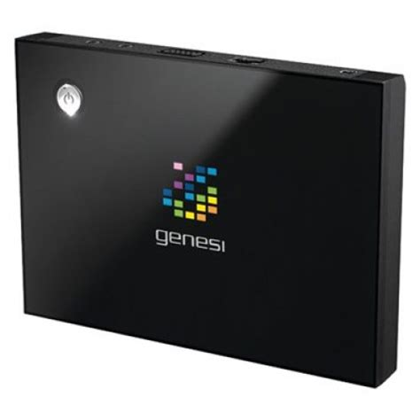

# CRUX on Genesi Efika MX



## Table of contents
- [About this device](#about-this-device)
- [Specifications](#specifications)
- [Installation](#installation)
- [Ports](#ports)


## About this device

This device was a donation from Genesi to CRUX-ARM.


## Specifications

- CPU: i.MX51 (ARM Cortex-A8) 800 MHz
- GPU: PowerVR SGX535
- RAM: 512 MB to 1 GB DDR2 SDRAM
- Storage: eMMC (4GB or 8GB), microSD
- USB Ports: 2 x USB 2.0 Host, 1 x USB OTG
- Ethernet: 10/100 Mbps Ethernet
- HDMI: 1 x HDMI 1.3 (1080p)
- Audio: Line-out (3.5mm), I2S


## Installation<a name="installation"></a>

TODO

## Ports<a name="ports"></a>

Download and install `efikamx-arm` repository overlay
```shell
sudo wget -P /etc/ports https://raw.githubusercontent.com/sepen/crux-ports-efikamx-arm/3.7/efikamx-arm.httpup
sudo ports -u efikamx-arm
```

### pkgutils

Use this gist (`arminfo.sh`) to get configure CFLAGS on ARM devices
```shell
curl -s https://gist.githubusercontent.com/sepen/4ae1d5e2f7782ba2848ef58989ed906e7ba11a2a5de9/arminfo.sh | bash
HOSTNAME   efikamx
MODEL      ARMv7 Processor rev 5 (v7l)
FEATURES   swp half thumb fastmult vfp edsp thumbee neon vfpv3
MACHTYPE   arm-unknown-linux-gnueabihf
CFLAGS     -march=armv7-a -mabi=aapcs-linux -mfloat-abi=hard -mtune=cortex-a8 -mfpu=vfpv3-d16
MAKEFLAGS  -j1
```

Use this information to update [/etc/pkgmk.conf](etc/pkgmk.conf)